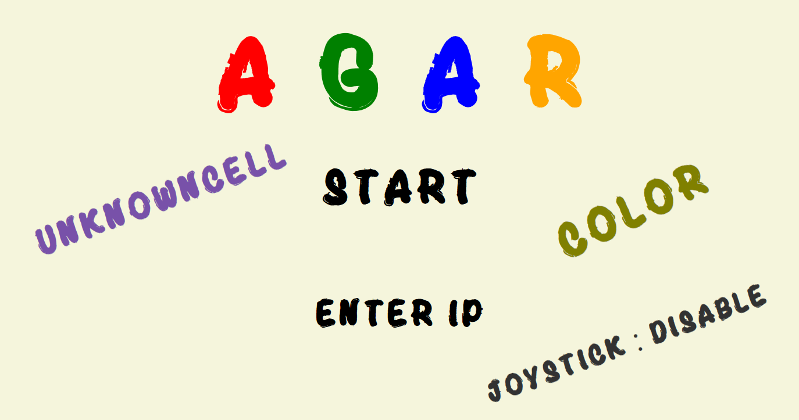
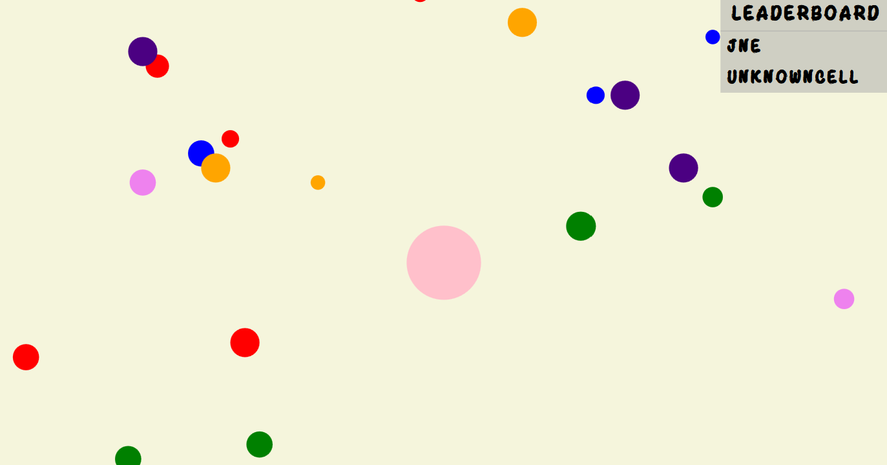

# Agar
一個基於 WPF 的局域網遊戲，使用 Host 與 Client 架構。

## 程式碼庫

[Host (https://github.com/JneJne829/UDPHost)](https://github.com/JneJne829/UDPHost) 
[Client (https://github.com/JneJne829/UDPWPFClient)](https://github.com/JneJne829/UDPWPFClient)

## 簡單介紹

[Gamma (https://gamma.app/public/A-g-a-r-h9w2h76a4sf6bsz)](https://gamma.app/public/A-g-a-r-h9w2h76a4sf6bsz)
